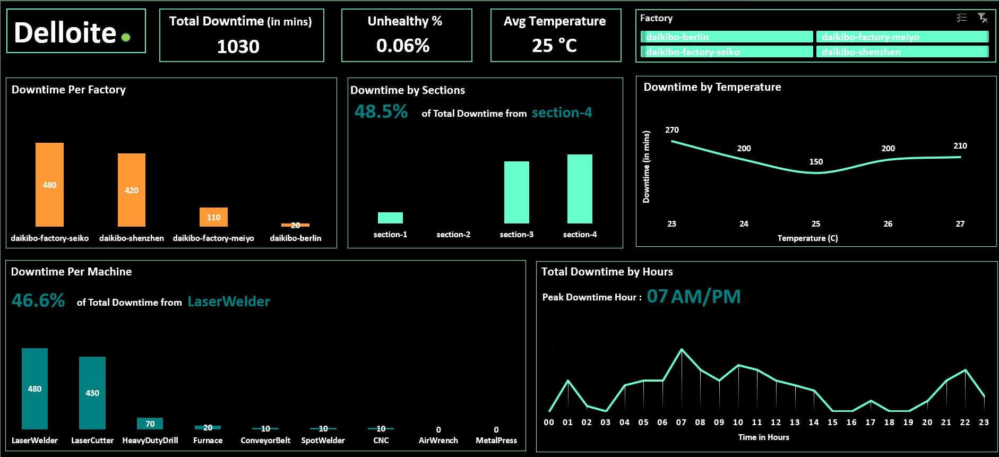

# Deloitte Data Analytics Virtual Internship

# Objective
The objective of this project is to analyze unified telemetry data collected from four Daikibo factories over the month of May 2021 to identify patterns of machine breakdowns. Specifically, the analysis aims to determine:
Which factory location experienced the most machine breakdowns, and
Which specific machine types contributed most to the downtime in that location.
This insight will help Daikibo improve its predictive maintenance strategy, reduce downtime, and enhance operational efficiency across its global manufacturing units.

# Tools and Concept Used
* **Power Query (Excel)**
  Imported and transformed **raw JSON telemetry data into structured tabular format.**
  Created calculated columns to identify and quantify machine **unhealthy status (10 mins per event**).
  Converted timestamps into **readable Date-Time format using Unix epoch transformation.**
* **Excel (Advanced Pivot Tables & Dashboarding)**

# Dashboard 

# Conclusion
* Daikibo's telemetry data revealed that **daikibo-factory-seiko** had the highest number of machine breakdowns during May 2021.
* Within that factory, **LaserWelder** was responsible for the most frequent unhealthy events, indicating potential reliability issues.
* Downtime was found to occur consistently in specific time windows between **6 AM - 9 AM**, suggesting patterns worth further investigation.

# Recommendations
* Focus on the factory with the most breakdowns and fix the main issues causing machine failures.
* Check the machines that break the most and do regular maintenance to prevent problems.
* Set up alerts so the team knows when a machine becomes unhealthy.
* Look at more months of data to see if there are long-term patterns.

